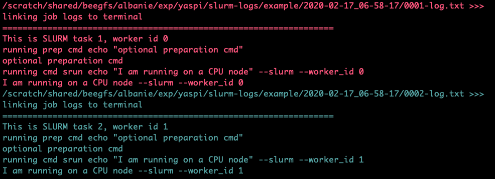
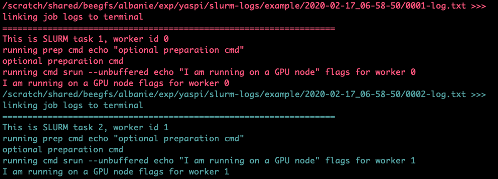
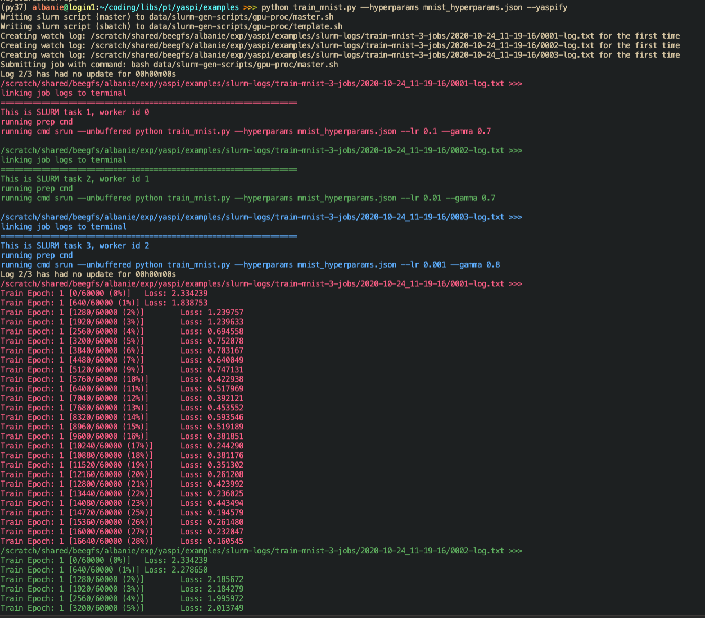

### yaspi - yet another slurm python interface

The goal of `yaspi` is to provide an interface to submitting [slurm](https://slurm.schedmd.com/documentation.html) jobs, thereby obviating the joys of sbatch files.  It does so through `recipes` - these are collections of templates and rules for generating sbatch scripts.


### Installation

Install via `pip install yaspi`.  If you prefer to hack around with the source code, it's a [single python file](yaspi/yaspi.py).

It should be considered (highly) experimental.

### Implementation

`yaspi` makes heavy usage of slurm [job arrays](https://slurm.schedmd.com/job_array.html).  

### Supported recipes:

* `cpu-proc` - a generic recipe for submitting CPU jobs via a job array.
* `gpu-proc` - a generic recipe for submitting GPU jobs via a job array.
* `ray` - job submissions for the [ray scheduler](https://github.com/ray-project/ray).

### Dependencies

* `Python >= 3.6`
* `watchlogs`

### Requirements:

`yaspi` has been tested on CentOS Linux release 7.7.1908 with slurm 18.08.7 and Python 3.7. YMMV on other platforms.

### Usage and outputs

`yaspi` can be used either from the command-line or directly from a python program.  Command-line usage is shown in the following examples (the effect of each argument is documented in the [implementation](yaspi/yaspi.py)).

**Code - scheduling a slurm job array with CPUs**:
```
prep_command='echo \"optional preparation cmd\"'
command='echo \"I am running on a CPU node\"'
yaspi --job_name=example \
       --job_array_size=2 \
       --cpus_per_task=5 \
       --cmd="$command" \
       --prep="$prep_command" \
       --recipe=cpu-proc \
       --mem=10G
```
**Effect**: This will run the `command` value on two workers as part of a slurm [job array](https://slurm.schedmd.com/job_array.html).  Each worker will be allocated 5 CPUs and 10G of memory by the scheduler.  Each worker will also be passed two extra flags, `--slurm` (without options) and `--worker_id` (which will be given the 0-indexed value of the current worker index in the job array) which can be used to assign tasks to the worker.  The `--prep` flag is optional, and will run a commands prior to the main job (e.g. to change into an appropriate code directory).  The effect of the command will be to produce the following:

```
# run on CPU job array worker 0
optional preparation cmd
I am running on a CPU node --slurm --worker_id 0

# run on CPU job array worker 1
optional preparation cmd
I am running on a CPU node --slurm --worker_id 1
```

When launched, a slightly more verbose (and colourized) output will be produced by [watchlogs](https://github.com/albanie/watchlogs) (this assumes your terminal supports color sequences):




**Code - scheduling a slurm job array with GPUs**:
```
prep_command='echo \"optional preparation cmd\"'
job_queue="\"flags for worker 0\" \"flags for worker 1\""
command='echo \"I am running on a GPU node\"'
yaspi --job_name=example \
      --job_array_size=2 \
      --cpus_per_task=5 \
      --gpus_per_task=1 \
      --prep="$prep_command" \
      --cmd="$command" \
      --recipe=gpu-proc \
      --job_queue="$job_queue" \
      --mem=10G
```
**Effect**: This command is similar to the `cpu-proc` recipe described above. Again, the `command` will be run on two workers as part of a slurm [job array](https://slurm.schedmd.com/job_array.html).  Each worker will be allocated 5 CPUs and 10G of memory by the scheduler, as well as one GPU. One further difference is that `gpu-proc` also takes an `job_queue` option that can be used to pass options to each GPU worker separately.



**Extras - custom directives**:

The previous example can be extended with custom directives.  For example, suppose
you wish to add an extra directive to your `sbatch` of the form
`#SBATCH --comment "a harmless comment goes here"`.  You can do this as follows:
```
prep_command='echo \"optional preparation cmd\"'
job_queue="\"flags for worker 0\" \"flags for worker 1\""
command='echo \"I am running on a GPU node\"'
custom_directive='#SBATCH --comment "a harmless comment goes here"'
python yaspi.py --job_name=example \
      --job_array_size=2 \
      --cpus_per_task=5 \
      --gpus_per_task=1 \
      --prep="$prep_command" \
      --cmd="$command" \
      --recipe=gpu-proc \
      --job_queue="$job_queue" \
      --custom_directive="$custom_directive" \
      --mem=10G
```

Custom directives can also be added to json config. For example, to receive emails from slurm, add a `"custom_directives"` flag:

```
{
      ...
      "custom_directives": "#SBATCH --mail-type=END,FAIL\n#SBATCH --mail-user=your_email_address",
}
```

**Code - scheduling a job with the [ray](https://ray.readthedocs.io/en/latest/index.html) framework:**

```
yaspi_dir=$(yaspi --install_location)
command="python $yaspi_dir/misc/minimal_ray_example.py"
yaspi --job_name=example \
      --cmd="$command" \
      --job_array_size=3 \
      --cpus_per_task=2 \
      --gpus_per_task=1 \
      --mem=10G \
      --recipe=ray
```

**Effect**: Scheduling jobs with the ray framework operates in a slightly different manner to the previous two examples (both of which assume [embarrasingly parallel](https://en.wikipedia.org/wiki/Embarrassingly_parallel) processing i.e. no communication between the workers). The ray receipe similarly launches a slurm job array, but assigns the job at index 0 to be the *master*, and all other nodes as *worker* nodes. The command is run *only* on the master node, which then uses ray to allocate tasks to the worker nodes. The command above will launch a slurm job, with the name "example", that: (1) initialises a ray head node and a set of 2 ray workers via a SLURM array job; (2) launches `$command` from the head node. It will produce an output similar to the following:


```
started ray head node
timestamp from worker: 2020-02-17 06:40:44.861733
timestamp from worker: 2020-02-17 06:40:44.861793
timestamp from worker: 2020-02-17 06:40:45.062484
timestamp from worker: 2020-02-17 06:40:45.065494
```

**Code - using yaspi directly from python**:


An example for training multiple MNIST runs is given in [train_mnist.py](examples/train_mnist.py). Running this file should launch three jobs on SLURM, each with different hyperparameters, producing the output below:




**Modifying your code to use Yaspi**:

To run an existing piece of code with yaspi requires two things:
1. A json file containing SLURM settings (e.g. these [yaspi_settings](examples/yaspi_settings.json)). This file will set the options that you would normally set in an SBATCH script (e.g. number of GPUS, total job duration etc.) together with any bash commands you would usually run to set up your job environment (these are supplied via the `"env_estup"` option)
2. A small block of logic somewhere in your script (visible for the MNIST example [here](https://github.com/albanie/yaspi/blob/master/examples/train_mnist.py#L120-L165)) which sets the job name and calls the Yaspi `submit()` function.
